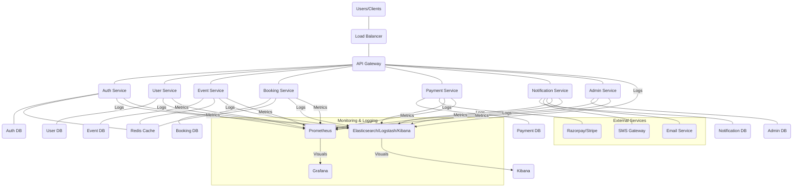

## Full-Stack Architecture for an Event Booking Web Application

This document outlines a comprehensive full-stack architecture for an event booking web application, focusing on scalability, security, and maintainability. The design incorporates React.js for the frontend, Spring Boot for the backend, PostgreSQL/MySQL for the database, and JWT for authentication.

### 1. Overall System Architecture

The system will follow a microservices-oriented architecture, allowing for independent development, deployment, and scaling of different functional modules.

Explanation:

- Clients: Web browsers (React.js application).
    
- Load Balancer: Distributes incoming traffic across multiple instances of the API Gateway.
    
- API Gateway (e.g., Spring Cloud Gateway, Nginx): Acts as a single entry point for all client requests, handling routing, authentication (initial JWT validation), rate limiting, and logging.
    
- Microservices:
    

- Auth Service: Handles user registration, login, JWT generation/validation, password management.
    
- User Service: Manages user profiles.
    
- Event Service: Manages event creation, listing, search, categories, venues, and seating plans.
    
- Booking Service: Handles seat selection, locking, booking creation, and managing booking statuses.
    
- Payment Service: Integrates with external payment gateways and handles payment status.
    
- Notification Service: Sends email/SMS confirmations and reminders.
    
- Admin Service: Provides functionalities for event organizers and administrators (event management, analytics).
    

- Databases: Each microservice can have its own dedicated database (polyglot persistence is an option, but for simplicity, we'll assume a shared PostgreSQL/MySQL instance with separate schemas or databases per service).
    
- Redis Cache: Used for caching frequently accessed data (e.g., event listings, real-time seat availability) and session management.
    
- External Services: Payment Gateway (Razorpay/Stripe), SMS Gateway, Email Service.
    
- Monitoring & Logging: ELK Stack (Elasticsearch, Logstash, Kibana) for centralized logging and Prometheus/Grafana for metrics collection and visualization.
    

### 2. Frontend: React.js (with Vite, Tailwind CSS)

The frontend will be a Single Page Application (SPA) built with React, leveraging Vite for fast development and Tailwind CSS for utility-first styling.

#### Component-Based Structure

The application will be structured into reusable and modular components, following a clear hierarchy.

src/  
├── App.jsx  
├── main.jsx  
├── index.css (Tailwind CSS imports)  
├── assets/  
│   └── images/  
│   └── icons/  
├── components/  
│   ├── common/  
│   │   ├── Button.jsx  
│   │   ├── InputField.jsx  
│   │   ├── Modal.jsx  
│   │   ├── LoadingSpinner.jsx  
│   │   ├── Header.jsx  
│   │   ├── Footer.jsx  
│   │   └── Pagination.jsx  
│   ├── events/  
│   │   ├── EventCard.jsx  
│   │   ├── EventFilter.jsx  
│   │   ├── EventSearch.jsx  
│   │   └── SeatMap.jsx  
│   ├── booking/  
│   │   ├── SeatSelector.jsx  
│   │   ├── BookingSummary.jsx  
│   │   └── PaymentForm.jsx  
│   ├── auth/  
│   │   ├── LoginForm.jsx  
│   │   └── RegisterForm.jsx  
│   ├── profile/  
│   │   ├── UserProfile.jsx  
│   │   └── BookingHistory.jsx  
│   ├── admin/  
│   │   ├── EventForm.jsx  
│   │   ├── VenueForm.jsx  
│   │   └── AnalyticsDashboard.jsx  
├── pages/  
│   ├── HomePage.jsx  
│   ├── EventListPage.jsx  
│   ├── EventDetailPage.jsx  
│   ├── BookingPage.jsx  
│   ├── LoginPage.jsx  
│   ├── RegisterPage.jsx  
│   ├── ProfilePage.jsx  
│   ├── AdminDashboardPage.jsx  
│   └── NotFoundPage.jsx  
├── hooks/  
│   ├── useAuth.js  
│   ├── useEvents.js  
│   └── useBookings.js  
├── context/  
│   ├── AuthContext.js  
│   └── BookingContext.js  
├── services/  
│   ├── api.js (Axios instance for API calls)  
│   ├── authService.js  
│   ├── eventService.js  
│   └── bookingService.js  
├── utils/  
│   ├── helpers.js  
│   └── constants.js  
└── router/  
    └── index.jsx (React Router setup)  
  

#### Frontend System Design

- State Management:
    

- Context API/Zustand: For global state like user authentication status, user profile, and potentially a global booking cart.
    
- useState / useReducer: For local component state and complex state transitions within components.
    
- react-query / swr: For efficient data fetching, caching, and synchronization with the backend APIs. This will handle loading states, error handling, and re-fetching data automatically.
    

- Routing: react-router-dom for navigation between different pages.
    
- API Communication: axios for making HTTP requests to the backend RESTful APIs. A centralized api.js file will configure the axios instance with base URL, interceptors for JWT token attachment, and error handling.
    
- Styling: Tailwind CSS for rapid UI development and responsive design.
    
- Form Handling: React Hook Form for efficient form validation and submission.
    
- Responsiveness: Extensive use of Tailwind's responsive utility classes (sm:, md:, lg:) to ensure optimal viewing on all devices.
    
- Authentication Flow:
    

1. User logs in via LoginForm.
    
2. authService.login() makes an API call to the Auth Service.
    
3. Upon successful login, the JWT token is received and stored securely (e.g., in localStorage or sessionStorage).
    
4. The AuthContext is updated, and the user is redirected to the home page.
    
5. An axios interceptor automatically attaches the JWT token to all subsequent API requests.
    
6. Protected routes are guarded using AuthContext to check for authentication status.
    

#### Suggested Third-Party Libraries (Frontend)

- Build Tool: Vite (fast development server, build optimization)
    
- Styling: Tailwind CSS (utility-first CSS framework)
    
- Routing: react-router-dom
    
- HTTP Client: axios
    
- State Management: zustand (lightweight, flexible alternative to Redux) or React's built-in Context API
    
- Data Fetching/Caching: react-query (or swr)
    
- Form Validation: react-hook-form
    
- Icons: lucide-react or react-icons
    
- Date Picker: react-datepicker
    
- UI Components: shadcn/ui (for pre-built, accessible UI components styled with Tailwind CSS)
    
- Charts (for Admin Dashboard): recharts or chart.js with react-chartjs-2
    
- PDF Generation (for e-tickets): react-pdf (if generating on client-side) or rely on backend-generated PDFs.
    

### 3. Backend: Java (Spring Boot)

The backend will be built using Spring Boot, following a microservices pattern. Each service will be a separate Spring Boot application.

#### RESTful API Design

All APIs will be RESTful, stateless, and follow standard HTTP methods. Versioning will be implemented using URI versioning (e.g., /api/v1/events).

Base URL: https://api.yourapp.com/api/v1

Common Headers:

- Authorization: Bearer <JWT_TOKEN> (for authenticated requests)
    
- Content-Type: application/json
    
- Accept: application/json
    

Error Handling: Standard HTTP status codes (400 Bad Request, 401 Unauthorized, 403 Forbidden, 404 Not Found, 500 Internal Server Error) with consistent JSON error responses.

{  
  "timestamp": "2023-10-27T10:30:00Z",  
  "status": 404,  
  "error": "Not Found",  
  "message": "Event with ID 123 not found",  
  "path": "/api/v1/events/123"  
}  
  

Swagger/OpenAPI: Each microservice will expose its API documentation using SpringDoc OpenAPI (Swagger UI).

#### Service Breakdown and API Endpoints

1. Auth Service

- Purpose: User authentication, registration, JWT generation.
    
- Endpoints:
    

- POST /auth/register: Register a new user.
    

- Request: { "email": "...", "password": "...", "role": "USER" }
    
- Response: { "message": "User registered successfully" }
    

- POST /auth/login: Authenticate user and issue JWT.
    

- Request: { "email": "...", "password": "..." }
    
- Response: { "token": "...", "refreshToken": "...", "expiresIn": 3600 }
    

- POST /auth/refresh-token: Refresh JWT using refresh token.
    

- Request: { "refreshToken": "..." }
    
- Response: { "token": "...", "expiresIn": 3600 }
    

- GET /auth/validate-token: Validate JWT (internal for API Gateway/other services).
    

- Response: { "isValid": true, "userId": "...", "roles": [...] }
    

2. User Service

- Purpose: Manage user profiles.
    
- Endpoints:
    

- GET /users/{userId}: Get user profile by ID. (Auth: USER, ADMIN)
    
- PUT /users/{userId}: Update user profile. (Auth: USER, ADMIN)
    
- DELETE /users/{userId}: Delete user. (Auth: ADMIN)
    
- GET /users/me: Get current authenticated user's profile. (Auth: USER, ADMIN, ORGANIZER)
    

3. Event Service

- Purpose: Manage events, venues, categories, seating plans.
    
- Endpoints:
    

- GET /events: Get all events (with filters: category, city, venue, time, price, rating, search, sort, pagination).
    
- GET /events/{eventId}: Get event details.
    
- POST /events: Create new event. (Auth: ORGANIZER, ADMIN)
    
- PUT /events/{eventId}: Update event. (Auth: ORGANIZER, ADMIN)
    
- DELETE /events/{eventId}: Delete event. (Auth: ORGANIZER, ADMIN)
    
- GET /categories: Get all event categories.
    
- GET /venues: Get all venues.
    
- GET /venues/{venueId}/seating-plan: Get seating plan for a venue.
    
- POST /venues: Create new venue. (Auth: ADMIN)
    
- PUT /venues/{venueId}: Update venue. (Auth: ADMIN)
    

4. Booking Service

- Purpose: Handle seat selection, locking, booking creation, and managing booking statuses.
    
- Endpoints:
    

- GET /events/{eventId}/available-seats: Get real-time available seats for an event.
    
- POST /events/{eventId}/lock-seats: Temporarily lock selected seats.
    

- Request: { "seatIds": ["S1", "S2"], "tier": "VIP" }
    
- Response: { "lockId": "...", "expiresAt": "..." }
    

- POST /bookings: Create a new booking.
    

- Request: { "eventId": "...", "lockedSeats": [...], "lockId": "...", "totalAmount": "..." }
    
- Response: { "bookingId": "...", "paymentLink": "..." }
    

- GET /bookings/{bookingId}: Get booking details. (Auth: USER, ADMIN, ORGANIZER)
    
- GET /users/me/bookings: Get all bookings for the current user. (Auth: USER)
    
- PUT /bookings/{bookingId}/cancel: Cancel a booking. (Auth: USER, ADMIN)
    

5. Payment Service

- Purpose: Integrate with payment gateways, handle payment callbacks.
    
- Endpoints:
    

- POST /payments/initiate: Initiate payment for a booking. (Internal call from Booking Service)
    

- Request: { "bookingId": "...", "amount": "...", "currency": "INR" }
    
- Response: { "paymentGatewayUrl": "...", "orderId": "..." }
    

- POST /payments/callback/{gateway}: Webhook endpoint for payment gateway callbacks. (Publicly accessible)
    

- Logic: Verify signature, update booking status (success/failure), trigger notification service.
    

6. Notification Service

- Purpose: Send email/SMS notifications.
    
- Endpoints:
    

- POST /notifications/send: Send a generic notification. (Internal call from other services)
    

- Request: { "recipient": "email@example.com", "type": "EMAIL", "subject": "Booking Confirmation", "body": "..." }
    

- POST /notifications/booking-confirmation: Send booking confirmation. (Internal)
    
- POST /notifications/event-reminder: Send event reminder. (Internal)
    

7. Admin Service

- Purpose: Dashboard functionalities for admins and event organizers.
    
- Endpoints:
    

- GET /admin/events: Get all events (for admin view). (Auth: ADMIN, ORGANIZER)
    
- GET /admin/bookings: Get all bookings (for admin view). (Auth: ADMIN, ORGANIZER)
    
- GET /admin/analytics/ticket-sales: Get ticket sales analytics. (Auth: ADMIN, ORGANIZER)
    
- GET /admin/analytics/user-interest: Get user interest analytics. (Auth: ADMIN, ORGANIZER)
    
- GET /admin/users: Manage users (view, block). (Auth: ADMIN)
    

#### Spring Boot Service Breakdown

Each service will be a separate Spring Boot application, potentially in its own Git repository.

- Auth Service:
    

- AuthController: Handles /auth endpoints.
    
- AuthService: Business logic for registration, login, token management.
    
- UserRepository, RoleRepository: JPA repositories for user and role data.
    
- JwtTokenProvider: Utility for JWT generation and validation.
    
- PasswordEncoder: For password hashing (BCrypt).
    

- User Service:
    

- UserController: Handles /users endpoints.
    
- UserService: Business logic for user profile management.
    
- UserRepository: JPA repository for user data.
    

- Event Service:
    

- EventController: Handles /events endpoints.
    
- VenueController: Handles /venues endpoints.
    
- CategoryController: Handles /categories endpoints.
    
- EventService, VenueService, CategoryService: Business logic.
    
- EventRepository, VenueRepository, CategoryRepository, SeatingPlanRepository: JPA repositories.
    

- Booking Service:
    

- BookingController: Handles /bookings endpoints.
    
- BookingService: Business logic for seat locking, booking creation, status updates.
    
- BookingRepository, SeatAvailabilityRepository: JPA repositories.
    
- RedisService: Interacts with Redis for seat locking and caching.
    
- PaymentServiceClient: Feign client to call Payment Service.
    
- NotificationServiceClient: Feign client to call Notification Service.
    

- Payment Service:
    

- PaymentController: Handles /payments endpoints and callbacks.
    
- PaymentService: Business logic for payment initiation, status updates, gateway integration.
    
- PaymentRepository: JPA repository.
    
- RazorpayClient/StripeClient: Clients for interacting with payment gateways.
    
- BookingServiceClient: Feign client to update Booking Service.
    

- Notification Service:
    

- NotificationController: Handles /notifications endpoints.
    
- NotificationService: Business logic for sending emails/SMS.
    
- EmailSender, SmsSender: Integrates with external email/SMS providers.
    
- NotificationTemplateEngine: For rendering email templates.
    

- Admin Service:
    

- AdminController: Handles /admin endpoints.
    
- AdminService: Orchestrates calls to other services (Event, Booking, User) for admin views and analytics.
    
- Might use Feign clients to communicate with other microservices.
    

#### Backend System Design

- Microservices Communication:
    

- Synchronous: RESTful API calls using RestTemplate or Spring Cloud OpenFeign for service-to-service communication (e.g., Booking Service calling Payment Service).
    
- Asynchronous (Optional but Recommended for Scalability): Message queues (e.g., Apache Kafka, RabbitMQ) for event-driven communication (e.g., Payment Service publishing a PaymentSuccessfulEvent that Notification Service consumes).
    

- Database per Service: Each microservice will ideally have its own database instance or at least a dedicated schema to ensure loose coupling and independent evolution.
    
- Caching: Spring Cache with Redis as the caching provider for high-read operations (e.g., event listings, available seats).
    
- Security: Spring Security for JWT validation, role-based authorization, and securing API endpoints.
    
- Logging: SLF4J with Logback for structured logging. Logs will be shipped to a centralized ELK stack.
    
- Monitoring: Spring Boot Actuator endpoints for metrics, integrated with Prometheus.
    
- Configuration Management: Spring Cloud Config Server (optional, for externalized and centralized configuration).
    
- Service Discovery: Eureka Server or Kubernetes DNS for microservice registration and discovery.
    
- Error Handling: Global exception handlers (@ControllerAdvice) to provide consistent error responses.
    
- Input Validation: Use JSR 303 (Bean Validation) annotations (@Valid, @NotNull, @Size, etc.) on DTOs.
    

#### Suggested Third-Party Libraries (Backend)

- Web Framework: Spring Boot
    
- Database Access: Spring Data JPA (with Hibernate)
    
- Database Driver: PostgreSQL JDBC Driver (or MySQL Connector/J)
    
- Authentication: Spring Security, jjwt (for JWT handling)
    
- Caching: Spring Data Redis
    
- API Documentation: SpringDoc OpenAPI (for Swagger UI)
    
- Inter-service Communication: Spring Cloud OpenFeign
    
- Validation: Spring Boot Starter Validation
    
- Logging: Logback
    
- Monitoring: Spring Boot Actuator, Micrometer
    
- JSON Processing: Jackson (built-in with Spring Boot)
    
- Payment Gateway SDKs: Razorpay Java SDK or Stripe Java SDK
    
- Email Sending: Spring Boot Starter Mail (with JavaMailSender)
    
- SMS Sending: Twilio SDK or similar (if using a third-party SMS gateway)
    

### 4. Database: PostgreSQL (or MySQL)

We will use PostgreSQL for its robustness, advanced features, and strong support for JSON data types (useful for flexible seating plans).

#### ERD (Entity Relationship Diagram)

erDiagram  
    USER {  
        UUID id PK  
        VARCHAR email UNIQUE  
        VARCHAR password_hash  
        VARCHAR first_name  
        VARCHAR last_name  
        VARCHAR phone_number  
        VARCHAR role ENUM ("USER", "ADMIN", "ORGANIZER")  
        TIMESTAMP created_at  
        TIMESTAMP updated_at  
    }  
  
    EVENT_CATEGORY {  
        UUID id PK  
        VARCHAR name UNIQUE  
        VARCHAR description  
    }  
  
    VENUE {  
        UUID id PK  
        VARCHAR name UNIQUE  
        VARCHAR address  
        VARCHAR city  
        VARCHAR state  
        VARCHAR zip_code  
        JSONB seating_plan_config  
        VARCHAR contact_info  
    }  
  
    EVENT {  
        UUID id PK  
        VARCHAR title  
        VARCHAR description  
        TIMESTAMP start_time  
        TIMESTAMP end_time  
        VARCHAR image_url  
        DECIMAL base_price  
        VARCHAR status ENUM ("UPCOMING", "ACTIVE", "COMPLETED", "CANCELLED")  
        UUID category_id FK  
        UUID venue_id FK  
        UUID organizer_id FK "References USER.id where role='ORGANIZER'"  
        TIMESTAMP created_at  
        TIMESTAMP updated_at  
    }  
  
    TICKET_TIER {  
        UUID id PK  
        UUID event_id FK  
        VARCHAR name  
        DECIMAL price  
        INT total_seats  
        INT available_seats  
        VARCHAR description  
    }  
  
    SEAT {  
        UUID id PK  
        UUID venue_id FK  
        VARCHAR seat_identifier UNIQUE "e.g., A1, B2"  
        VARCHAR seat_row  
        VARCHAR seat_column  
        VARCHAR type ENUM ("REGULAR", "VIP", "ACCESSIBLE")  
        BOOLEAN is_available  
    }  
  
    EVENT_SEAT_AVAILABILITY {  
        UUID id PK  
        UUID event_id FK  
        UUID seat_id FK  
        UUID ticket_tier_id FK  
        BOOLEAN is_available  
        BOOLEAN is_locked "For real-time locking"  
        TIMESTAMP locked_until "Timestamp for seat lock expiry"  
    }  
  
    BOOKING {  
        UUID id PK  
        UUID user_id FK  
        UUID event_id FK  
        DECIMAL total_amount  
        VARCHAR status ENUM ("PENDING_PAYMENT", "CONFIRMED", "CANCELLED", "REFUNDED")  
        TIMESTAMP booking_time  
        VARCHAR payment_id UNIQUE "Reference to PAYMENT.id"  
        VARCHAR e_ticket_url  
    }  
  
    BOOKING_ITEM {  
        UUID id PK  
        UUID booking_id FK  
        UUID event_seat_availability_id FK "References EVENT_SEAT_AVAILABILITY.id for the specific seat booked"  
        UUID ticket_tier_id FK  
        DECIMAL price_at_booking  
    }  
  
    PAYMENT {  
        UUID id PK  
        UUID booking_id FK  
        VARCHAR gateway_payment_id UNIQUE "ID from Razorpay/Stripe"  
        VARCHAR method  
        DECIMAL amount  
        VARCHAR currency  
        VARCHAR status ENUM ("INITIATED", "SUCCESS", "FAILED", "REFUNDED")  
        TIMESTAMP payment_time  
        JSONB gateway_response_data  
    }  
  
    NOTIFICATION {  
        UUID id PK  
        UUID user_id FK  
        VARCHAR type ENUM ("EMAIL", "SMS")  
        VARCHAR subject  
        TEXT body  
        TIMESTAMP sent_at  
        BOOLEAN is_read  
    }  
  
    USER ||--o{ BOOKING : "has"  
    USER ||--o{ EVENT : "organizes"  
    EVENT ||--o{ BOOKING : "has"  
    EVENT ||--o{ TICKET_TIER : "has"  
    EVENT ||--o{ EVENT_SEAT_AVAILABILITY : "has"  
    EVENT ||--o{ NOTIFICATION : "triggers"  
    EVENT_CATEGORY ||--o{ EVENT : "categorizes"  
    VENUE ||--o{ EVENT : "hosts"  
    VENUE ||--o{ SEAT : "has"  
    SEAT ||--o{ EVENT_SEAT_AVAILABILITY : "defines"  
    TICKET_TIER ||--o{ BOOKING_ITEM : "defines"  
    EVENT_SEAT_AVAILABILITY ||--o{ BOOKING_ITEM : "booked"  
    BOOKING ||--o{ BOOKING_ITEM : "contains"  
    BOOKING ||--o{ PAYMENT : "linked_to"  
  

Key Tables and Relationships:

- USER: Stores user details, including their role (USER, ADMIN, ORGANIZER).
    
- EVENT_CATEGORY: Defines categories for events (e.g., Music, Sports).
    
- VENUE: Stores venue details. seating_plan_config can be a JSONB field to store flexible seating layouts (e.g., rows, columns, sections, VIP areas).
    
- EVENT: Core event details, linking to a category, venue, and an organizer (a user with ORGANIZER role).
    
- TICKET_TIER: Defines different pricing tiers for an event (e.g., VIP, Regular) and their associated prices and total seats available for that tier.
    
- SEAT: Represents individual physical seats within a venue. seat_identifier is a unique code (e.g., "A1", "B2").
    
- EVENT_SEAT_AVAILABILITY: This is crucial for real-time seat management. It links a specific SEAT in a VENUE to an EVENT and a TICKET_TIER, indicating its availability and whether it's currently locked. is_locked and locked_until fields are used for the locking mechanism.
    
- BOOKING: Stores overall booking information, linking to a user, event, and payment.
    
- BOOKING_ITEM: Details individual seats or tickets within a booking, referencing EVENT_SEAT_AVAILABILITY for the exact seat booked.
    
- PAYMENT: Records payment transactions, linking to a booking and storing details from the payment gateway.
    
- NOTIFICATION: Stores details of sent notifications.
    

Seat Locking Mechanism:

When a user selects seats, the Booking Service will:

1. Temporarily mark the selected EVENT_SEAT_AVAILABILITY records as is_locked = TRUE and set locked_until to a short expiry time (e.g., 5-10 minutes).
    
2. Store the lockId in Redis with the same expiry.
    
3. If the booking is confirmed within the locked_until time, is_locked is set to FALSE and is_available to FALSE.
    
4. If the lock expires, a background job or Redis event listener will release the lock (is_locked = FALSE, is_available = TRUE).
    

### 5. Authentication & Authorization: JWT-based

- Authentication:
    

1. User sends credentials (email/password) to Auth Service's /auth/login endpoint.
    
2. Auth Service validates credentials against the database.
    
3. If valid, it generates an Access Token (JWT) and a Refresh Token.
    
4. The Access Token is short-lived (e.g., 15-30 minutes) and contains user ID, roles, and expiry.
    
5. The Refresh Token is long-lived (e.g., 7-30 days) and used to obtain new Access Tokens without re-logging in.
    
6. Both tokens are sent to the client. The client stores them securely (e.g., Access Token in memory/session storage, Refresh Token in localStorage or HttpOnly cookie).
    

- Authorization:
    

1. For every subsequent request to any microservice, the client includes the Access Token in the Authorization: Bearer <JWT> header.
    
2. The API Gateway performs initial JWT validation (signature, expiry). If valid, it extracts user ID and roles and passes them as headers to the downstream microservice.
    
3. Each microservice uses Spring Security to intercept requests and perform role-based authorization based on the roles extracted from the JWT (e.g., @PreAuthorize("hasRole('ADMIN')")).
    

- Refresh Token Flow: When the Access Token expires, the client sends the Refresh Token to Auth Service's /auth/refresh-token endpoint to get a new Access Token.
    

### 6. Deployment

The architecture is designed for cloud-native deployment, leveraging Docker and Kubernetes.

#### CI/CD Pipeline Suggestion

1. Code Commit: Developers commit code to Git repository (e.g., GitHub, GitLab, Bitbucket).
    
2. CI Trigger: A CI tool (e.g., Jenkins, GitLab CI/CD, GitHub Actions, CircleCI) detects the commit.
    
3. Build & Test:
    

- Frontend: npm install, npm test, npm run build (creates static assets).
    
- Backend: mvn clean install (builds JARs), runs unit and integration tests.
    

4. Dockerize:
    

- Each microservice (backend) is built into a Docker image.
    
- Frontend static assets are placed into an Nginx Docker image (or served from S3/GCS).
    

5. Image Push: Docker images are pushed to a Container Registry (e.g., Docker Hub, AWS ECR, GCP Container Registry).
    
6. CD Trigger: Upon successful image push, the CD pipeline is triggered.
    
7. Deployment to Kubernetes:
    

- Kubernetes manifests (YAML files defining Deployments, Services, Ingress, ConfigMaps, Secrets) are updated to reference the new Docker image versions.
    
- kubectl apply -f or Helm charts are used to deploy/update services in the Kubernetes cluster.
    
- Rolling updates are used to ensure zero downtime.
    

8. Monitoring & Rollback:
    

- Post-deployment health checks and monitoring (Prometheus, Grafana, ELK).
    
- Automated rollback to previous stable version if issues are detected.
    

#### Docker and Kubernetes

- Docker: Each microservice will have its own Dockerfile to create a lightweight, self-contained, and portable image.
    
- Kubernetes:
    

- Pods: Smallest deployable units, containing one or more containers (e.g., one Spring Boot microservice instance).
    
- Deployments: Manage the desired state of Pods, enabling rolling updates and rollbacks.
    
- Services: Provide stable network endpoints for Pods, enabling inter-service communication and load balancing within the cluster.
    
- Ingress: Manages external access to services in the cluster, acting as the API Gateway (or routing to a dedicated API Gateway service).
    
- ConfigMaps & Secrets: For externalizing configuration and sensitive data (database credentials, API keys).
    
- Horizontal Pod Autoscaler (HPA): Automatically scales the number of Pod replicas based on CPU utilization or custom metrics.
    
- Persistent Volumes (PV) & Persistent Volume Claims (PVC): For databases that require persistent storage.
    

### 7. Security Practices

- Password Hashing: Use strong, one-way hashing algorithms like BCrypt or Argon2 for storing passwords. Never store plain text passwords.
    
- JWT Security:
    

- Use strong, long, and randomly generated secret keys for signing JWTs.
    
- Set short expiry times for Access Tokens.
    
- Implement Refresh Token rotation and invalidation.
    
- Store JWTs securely on the client-side (e.g., localStorage is acceptable but consider sessionStorage or HttpOnly cookies for Refresh Tokens if possible).
    

- Rate Limiting: Implement rate limiting on API Gateway and critical endpoints (e.g., login, registration) to prevent brute-force attacks and abuse. (e.g., Spring Cloud Gateway's RequestRateLimiter).
    
- Input Validation: Strict server-side input validation on all incoming API requests to prevent injection attacks (SQL injection, XSS) and ensure data integrity. Use JSR 303 Bean Validation in Spring Boot.
    
- Role-Based Access Control (RBAC): Implement fine-grained authorization based on user roles (USER, ADMIN, ORGANIZER) using Spring Security's @PreAuthorize annotations.
    
- HTTPS/SSL: All communication between client and server, and between microservices, must be encrypted using HTTPS/SSL.
    
- CORS (Cross-Origin Resource Sharing): Properly configure CORS headers on the backend to allow requests only from trusted frontend domains.
    
- CSRF (Cross-Site Request Forgery) Protection: For state-changing operations, CSRF tokens should be used, especially if using session-based authentication (less critical with stateless JWTs, but still good practice for forms).
    
- XSS (Cross-Site Scripting) Prevention: Sanitize all user-generated content before rendering it on the frontend. React automatically escapes content, but backend validation is still crucial.
    
- OWASP Top 10: Regularly review and adhere to OWASP Top 10 security guidelines.
    
- Security Headers: Implement appropriate HTTP security headers (e.g., X-Content-Type-Options, X-Frame-Options, Strict-Transport-Security).
    
- Least Privilege: Grant only the necessary permissions to services and users.
    
- Secrets Management: Use environment variables, Kubernetes Secrets, or dedicated secrets management tools (e.g., HashiCorp Vault) for sensitive information.
    

### 8. Non-Functional Requirements

- Highly Scalable and Modular Design (Microservice-Ready):
    

- Microservices: Achieved by breaking down the application into independent, deployable services.
    
- Stateless Services: All services are designed to be stateless, allowing easy horizontal scaling.
    
- Asynchronous Communication: Using message queues (Kafka) for non-critical communications enhances scalability and fault tolerance.
    
- Database Sharding/Replication: For very large scale, databases can be sharded or replicated.
    
- Load Balancing: Essential at the API Gateway and within Kubernetes.
    

- Secure with Proper Input Validation and Role-Based Access: Covered in the Security Practices section.
    
- Efficient Caching for High-Read Operations (e.g., Redis):
    

- Event Listings: Cache popular event listings to reduce database load.
    
- Seat Availability: Use Redis for real-time seat locking and availability checks, which are highly concurrent.
    
- User Sessions/JWT Blacklisting: Redis can be used to manage JWT blacklists for invalidated tokens or for storing refresh tokens.
    

- Logging and Monitoring (e.g., ELK stack):
    

- Centralized Logging: All microservices will send their logs to a centralized ELK stack (Elasticsearch for storage, Logstash for processing, Kibana for visualization). This allows for easy troubleshooting, auditing, and analytics.
    
- Metrics Collection: Prometheus will scrape metrics from Spring Boot Actuator endpoints of each microservice.
    
- Alerting: Grafana will visualize metrics and configure alerts based on predefined thresholds (e.g., high error rates, low available memory).
    
- Distributed Tracing: Tools like Zipkin or Jaeger can be integrated to trace requests across multiple microservices, aiding in debugging and performance analysis.
    

- Mobile-Responsive Frontend:
    

- Tailwind CSS: Its mobile-first approach and responsive utility classes (sm:, md:, lg:) enable building adaptable UIs.
    
- Flexible Layouts: Use flexbox and grid for fluid layouts that adjust to different screen sizes.
    
- Viewport Meta Tag: Essential <meta name="viewport" content="width=device-width, initial-scale=1.0"> will be included in the HTML.
    
- Image Optimization: Use responsive images and lazy loading.
    

This architecture provides a robust, scalable, and secure foundation for a modern event booking web application.
